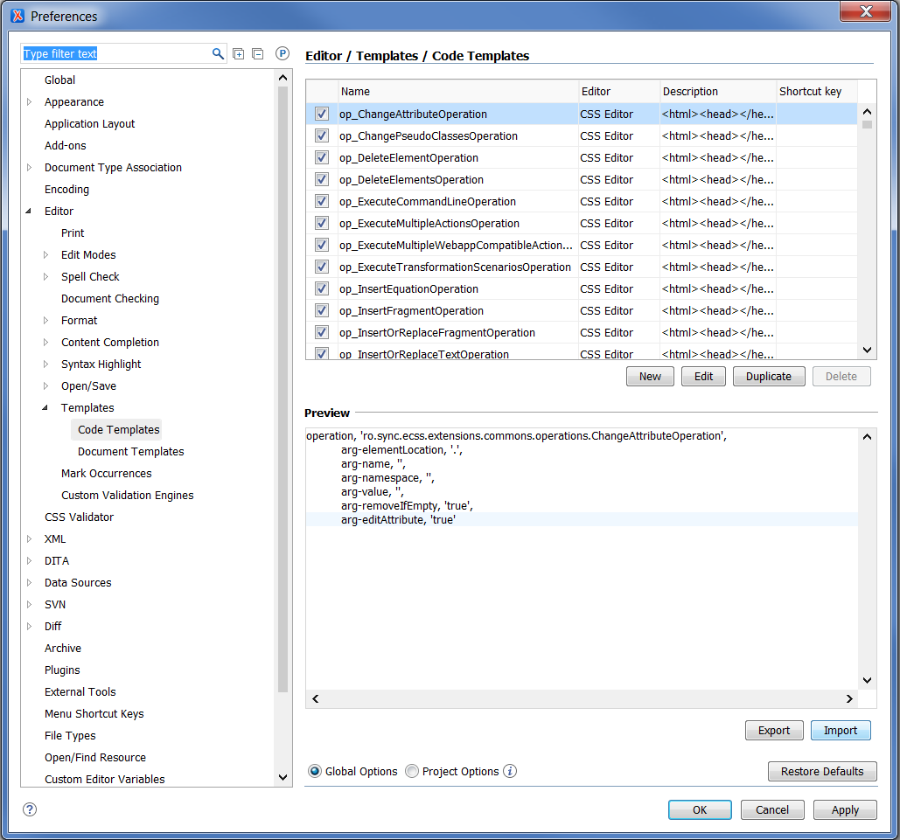
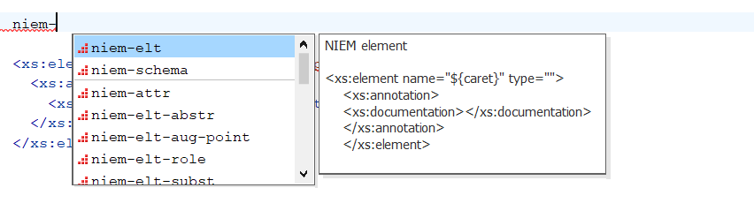
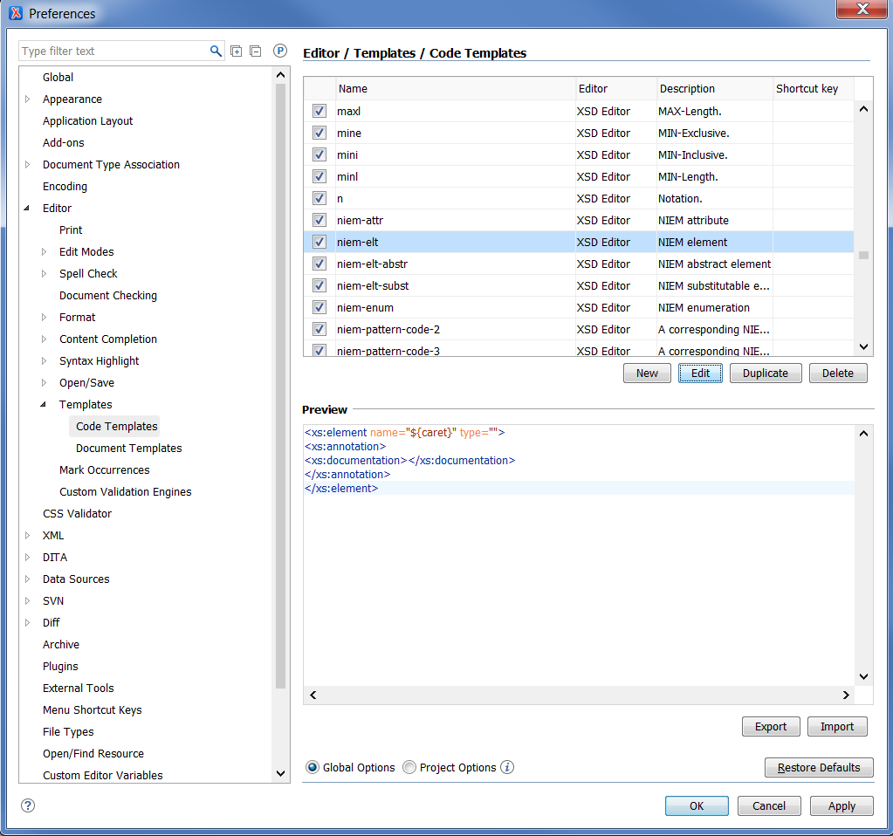
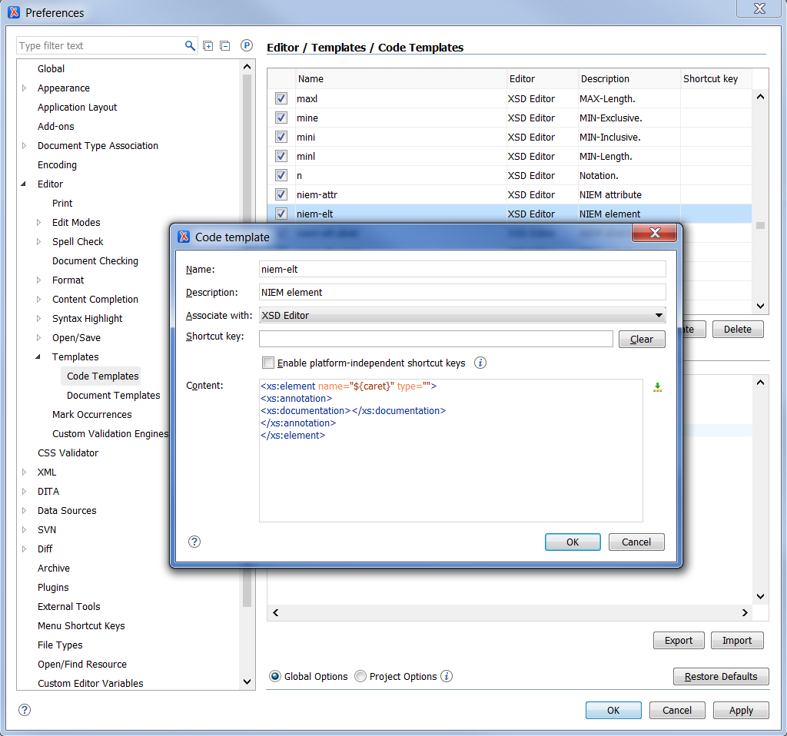

# Using NIEM snippets with Oxygen XML Editor

For more information on snippets in Oxygen, please their page about [Code Templates](https://www.oxygenxml.com/doc/versions/23.0/ug-editor/topics/code-templates-x-editing2.html).

- [Import snippets](#import-snippets)
- [Use a snippet](#use-a-snippet)
- [Modify a snippet](#modify-a-snippet)
- [Reload snippets](#reload-snippets)

## Import snippets

- Download the [NIEM Oxygen snippet file](niem-snippets-oxygen.xml)
- In Oxygen, click on menu item **Options** -> **Preferences...**
- In the left panel sidebar, click on **Editor** -> **Content Completion** -> **Code Templates**
- Click the Import button near the bottom right of the panel and select the downloaded snippets file

## Use a snippet

> Note: All NIEM snippets begin with "niem-"

- Type "niem" in an XML schema file
- Hit Ctrl/Cmd + Space
- Scroll through the drop-down list to see all snippets that begin with "niem".
- Hit "Tab" or "Enter" to load the snippet
- The snippet will be incomplete.
  - Fields like names and definitions may be partially provided or completely blank and must be filled in.
  - In some cases, defaults may be provided but can be changed as needed.

Tips

- Recently used snippets will appear at the top of the list
- The more you type in the snippet name before hitting Ctrl/Cmd + Space, the narrower the list will be.
  - "niem" + Ctrl/Cmd + Space will bring up a list of all NIEM snippets.
  - "niem-type" + Ctrl/Cmd + Space will filter the list of snippets to NIEM types.

## Modify a snippet

- In Oxygen, click on **Options** -> **Preferences**
- In the left panel sidebar, click **Editor** -> **Content Completion** -> **Code Templates**
- Scroll down and select the snippet to modify
  - The snippet will begin with "niem-"
  - NIEM snippets will appear under "XSD Editor" and/or "JSON Editor" group
- Click the "Edit" button

- Modify the snippet name, description, code, or add a keyboard shortcut.
- Notes:
  - The `${caret}` variable marks the position where the cursor will appear once the snippet is loaded.

## Reload snippets

- To load an updated snippets file, simply go through the original import steps again.
- Snippets with the same name and editor group will be overwritten.
- Individual snippets can be deleted or snippets can be reset by clicking the **Restore Defaults** button.
